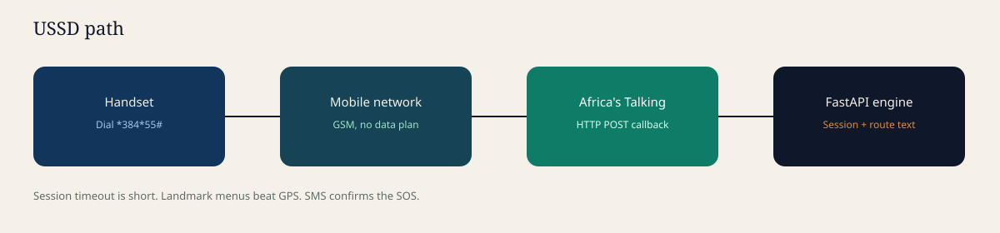

# Ramani

**Climate resilience engine for informal urban settlements.**

Ramani (Swahili for *map*) turns seasonal climate outlooks and unmapped alley geometry into something a Nairobi disaster officer and a resident on a feature phone can both use: a local vulnerability index, a dual-gateway SOS, and landmark-level evacuation text.

It is built for places standard maps stop ù Kibera, Mathare, and settlements like them ù where flash floods, heat, and a data black hole collide.


---

## The problem

Informal settlements house millions of people on high-density, low-infrastructure land. Climate shocks are no longer rare:

- **Flash floods** during El Niùo and extreme rainfall, often in minutes, along unmapped drains and alleys.
- **Urban heat islands** driven by metal roofing, almost no canopy, and blocked airflow.
- **Invisible infrastructure.** Commercial GIS and navigation apps end where formal roads end. Alleys, footbridges, and informal drainage do not exist on the municipal basemap.
- **Forecasts that stay regional.** GHACOF-style outlooks give seasonal rainfall terciles for a whole region. They do not say which 50-metre stretch of drain will back up first.
- **A communications cliff during the event.** Data drops, smartphones fail, and people on GSM-only handsets are cut out of the response.

Post-event, relief is slow because damage reports arrive late and unaudited.

## What Ramani does

Ramani is one engine with two faces.

| Who | Surface | Job |
| --- | --- | --- |
| City / county disaster units, planners, NGOs | Next.js + Mapbox planner | Micro-vulnerability heatmaps, El Niùo clearing priorities, SOS feed, damage pins |
| Residents | PWA **and** Africa's Talking USSD (`*384*55#`) | SOS, landmark evacuation text, hazard reports, local alert status |

It follows the disaster cycle ù but v1 is honest about what satellite data can and cannot do.


| Phase | Product | What we will not over-claim |
| --- | --- | --- |
| **Before** | Climate Vulnerability Index on a 30ù50 m grid; planner layers | We do not pretend Sentinel-2 + a seasonal outlook can name the exact 10 m alley that overflows first |
| **During** | SOS, dynamic alley graph, landmark routes over PWA/USSD | Routes are conservative guidance, not turn-by-turn GPS through unmapped terrain |
| **After** | Crowdsourced damage pins in the first 72 hours | Clear-sky satellite change detection is a later layer, not the first picture of loss |

---

## Architecture

```text
 Sentinel-2 / Landsat          GHACOF seasonal outlook
 OSM + community traces        Cell-ID / landmark reports
              \                      /
               \                    /
            FastAPI engine (this repo)
     CVI ù alley graph ù SOS ù USSD sessions
               /                    \
              /                      \
   Planner dashboard              Dual gateway
   (Next.js / Mapbox)          PWA  +  USSD *384*55#
```

### Climate Vulnerability Index

v1 is a **transparent weighted index**, not a black-box flood model. Planners can argue with the weights.

```text
CVI = w1ùdrainage_proximity
    + w2ùstructural_density
    + w3ùelevation_slope
    + w4ùghacof_rainfall_factor
```

Default weights live in `backend/app/services/cvi.py` and can be overridden per request. The GHACOF term is a **seasonal factor** (above/near/below-normal rainfall), not an event nowcast. Outlook identifiers (GHACOF 74, 75, ù) are data, not hardcoded product names.

### Unmapped routing

The informal-settlement graph `G = (V, E)` is seeded from:

1. Community landmarks (Line Saba, Silanga, Laini Saba, ù)
2. A curated alley/edge list (OSM where it exists, GPS traces where it does not)
3. Live hazard weights ù a blocked drain or rising water increases `E_w` so Dijkstra / A* prefers dry paths

USSD cannot render turn-by-turn maps. The API therefore returns **plain-language landmark routes**:

> EVACUATE NOW: Head east toward Highridge Road. Avoid Main Drain Alley. Safe haven: Community Center.

### Dual gateway




```text
Dial *384*55#   (Ramani Safety Gateway)

1. Trigger Emergency SOS
   1. Flood / trapped
   2. Structural collapse / fire
   3. Medical
   ? log landmark or Cell-ID, fan-out to the emergency view, SMS confirm

2. Get evacuation route
   ? pick a landmark zone ? text route

3. Report hazard
   1. Blocked drainage
   2. Rising flood water
   3. Damaged structure
   ? updates CVI / edge weights

4. Local climate alert status
   ? active El Niùo / GHACOF level for the selected area
```

Africa's Talking posts form-encoded callbacks to `POST /api/v1/ussd`. Sessions are short; the menu is landmark-based on purpose. Cell-ID is hundreds of metres wide ù it is a hint, not a GPS fix.

---

## Repository layout

```text
Ramani-2.0/
??? backend/                 FastAPI engine
?   ??? app/
?   ?   ??? main.py          App factory, CORS, routers
?   ?   ??? routers/         health, cvi, routing, incidents, ussd
?   ?   ??? services/        CVI, Dijkstra graph, USSD state machine
?   ?   ??? data/            Kibera landmarks + alley graph (seed)
?   ??? tests/
??? apps/
?   ??? planner/             City dashboard (Next.js)
?   ??? community/           Resident PWA (Next.js)
??? docs/assets/             Architecture diagrams used in this README
```

This is a **runnable skeleton**: real HTTP contracts, a seeded Kibera graph, and a USSD state machine. Satellite ingestion, Redis-backed sessions, and live Mapbox tiles are the next slice ù not fake completeness.

---

## Quick start

### Prerequisites

- Python 3.11+
- Node 20+

### Backend

```bash
cd backend
python -m venv .venv
# Windows: .venv\Scripts\activate
source .venv/bin/activate
pip install -r requirements.txt
uvicorn app.main:app --reload --port 8000
```

Open [http://localhost:8000/docs](http://localhost:8000/docs).

### Planner

```bash
cd apps/planner
npm install
npm run dev
```

[http://localhost:3000](http://localhost:3000)

### Community PWA

```bash
cd apps/community
npm install
npm run dev
```

[http://localhost:3001](http://localhost:3001)

| Service | URL |
| --- | --- |
| API | http://localhost:8000 |
| Planner | http://localhost:3000 |
| Community | http://localhost:3001 |

Copy `.env.example` to `.env` in each app that needs keys. Set `AFRICAS_TALKING_API_KEY` before pointing a sandbox shortcode at this API. Never commit real keys.

---

## HTTP surface (v1)

| Method | Path | Purpose |
| --- | --- | --- |
| `GET` | `/health` | Liveness |
| `GET` | `/api/v1/cvi` | Zone scores + optional weight override |
| `GET` | `/api/v1/cvi/layers` | Layer list for the planner |
| `POST` | `/api/v1/routes` | Safe path between two landmarks |
| `GET` | `/api/v1/landmarks` | Seeded Kibera landmarks |
| `POST` | `/api/v1/sos` | PWA SOS |
| `GET` | `/api/v1/sos` | Live emergency feed |
| `POST` | `/api/v1/hazards` | Crowdsourced hazard (reweights edges) |
| `GET` | `/api/v1/alerts` | Active climate / El Niùo status |
| `POST` | `/api/v1/ussd` | Africa's Talking callback |
| `GET` | `/api/v1/damage` | Post-event report pins |

Example route request:

```json
{
  "from_landmark": "line-saba",
  "to_landmark": "highridge"
}
```

---

## Safety and ethics

False evacuation advice during a flood can kill people. This codebase treats routing as **conservative guidance**:

- Prefer higher ground and known safe havens.
- Inflate weights on reported flood / blockage; never ùoptimisticallyù cross a hazard edge.
- USSD copy is short, local, and includes a disclaimer that conditions change.
- A human ops view (planner emergency feed) stays in the loop.

Do not market v1 as a nowcast that predicts the first overflowing metre of alley. The CVI is a planning index. Event-scale hydrology needs sensors, drainage surveys, and community traces we do not yet have.

Community mapping that already exists ù including [Map Kibera](https://mapkibera.org/) ù should be ingested, not replaced.

---

## Stack

| Layer | Choice | Why |
| --- | --- | --- |
| Engine | FastAPI | Callback-friendly, typed, quick to expose OpenAPI |
| Index | Transparent CVI | City officials can audit weights |
| Graph | In-process Dijkstra | Enough for a landmark graph; swap in NetworkX / Valhalla later |
| Planner | Next.js App Router | Spatial dashboard + ops views |
| Community | Next.js PWA | Installable, large tap targets |
| Offline GSM | Africa's Talking USSD + SMS | Feature phones, zero data |
| Maps (next) | Mapbox GL | Vector basemap + custom alley overlay |

---

## Roadmap

**Now (this skeleton)**  
Seeded Kibera landmarks, CVI endpoint, USSD menu, SOS/hazard APIs, planner and PWA shells.

**Next**  
Redis USSD sessions, Mapbox token wiring, Map Kibera / OSM import, SMS confirm via Africa's Talking, GHACOF outlook ingest as JSON.

**Later**  
Earth Engine NDVI / built-up layers, higher-res roof material CV, post-event satellite change detection, Mathare + a second settlement, sensor or drain-gauge weights.

---

## License

MIT. See [LICENSE](LICENSE).
